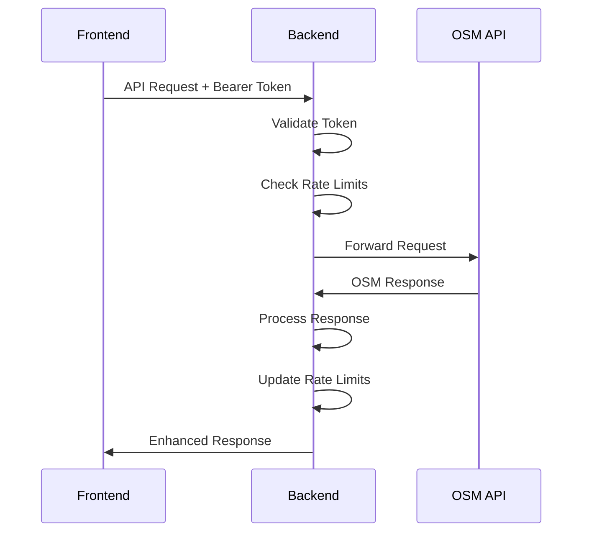

# OSM Integration Architecture

This document describes the integration patterns and architecture for connecting with the Online Scout Manager (OSM) API.

## Overview

The Vikings OSM Backend serves as a sophisticated proxy layer between frontend applications and the OSM API, providing authentication management, rate limiting, error handling, and response standardization.

## Integration Patterns

### 1. OAuth Proxy Pattern

The backend acts as an OAuth proxy, handling the complete OAuth 2.0 authorization code flow:

```
Frontend → Backend → OSM → Backend → Frontend
```

**Benefits:**
- Centralizes OAuth credential management
- Handles token refresh and expiration
- Provides consistent authentication across multiple frontends
- Protects OAuth secrets from client-side exposure

**Implementation:**
```javascript
// OAuth flow handling
app.get('/oauth/callback', async (req, res) => {
  const { code, state, frontend_url } = req.query;
  
  // Exchange authorization code for access token
  const tokenResponse = await exchangeCodeForToken(code);
  
  // Store token with session tracking
  storeTokenForSession(sessionId, tokenResponse);
  
  // Redirect to appropriate frontend
  const frontendUrl = determineFrontendUrl(state, frontend_url, req);
  res.redirect(`${frontendUrl}/auth-success`);
});
```

### 2. API Proxy Pattern

All OSM API requests are proxied through the backend with added functionality:

```
Frontend Request → Authentication → Rate Limiting → OSM API → Response Processing → Frontend Response
```

**Processing Pipeline:**
1. **Authentication Validation**: Verify Bearer token
2. **Parameter Validation**: Validate required parameters
3. **Rate Limit Check**: Check both backend and OSM limits
4. **OSM API Request**: Forward request to OSM
5. **Response Processing**: Parse and standardize response
6. **Rate Limit Update**: Update rate limit tracking
7. **Response Enhancement**: Add rate limit info and metadata

### 3. Session Management Pattern

The backend maintains session state for token management and rate limiting:

```javascript
// Session-based token storage
const userTokens = new Map(); // sessionId -> tokenData
const tokenToSessionId = new Map(); // token -> sessionId

// Session ID generation
const getSessionId = (req) => {
  const authHeader = req.headers.authorization;
  if (authHeader) {
    return crypto.createHash('sha256')
      .update(authHeader)
      .digest('hex')
      .substring(0, 16);
  }
  return req.sessionID || req.ip;
};
```

## OSM API Interaction

### Request Flow



### Error Handling Strategy

The backend implements comprehensive error handling for OSM API interactions:

```javascript
const handleOSMResponse = async (response, sessionId) => {
  // Handle rate limiting
  if (response.status === 429) {
    const osmInfo = getOSMRateLimitInfo(sessionId);
    return {
      error: 'OSM API rate limit exceeded',
      rateLimitInfo: osmInfo,
      retryAfter: 3600
    };
  }
  
  // Handle authentication errors
  if (response.status === 401) {
    return {
      error: 'OSM authentication failed',
      details: 'Token may be expired or invalid'
    };
  }
  
  // Handle server errors
  if (response.status >= 500) {
    return {
      error: 'OSM API temporarily unavailable',
      statusCode: response.status,
      retryAfter: 300
    };
  }
  
  // Parse successful response
  const text = await response.text();
  try {
    return JSON.parse(text);
  } catch (error) {
    return {
      error: 'Invalid JSON response from OSM',
      details: text.substring(0, 500)
    };
  }
};
```

### Rate Limit Integration

The backend tracks OSM rate limits in real-time:

```javascript
const updateOSMRateLimit = (response, sessionId) => {
  const remaining = parseInt(response.headers.get('x-ratelimit-remaining'));
  const limit = parseInt(response.headers.get('x-ratelimit-limit'));
  const reset = parseInt(response.headers.get('x-ratelimit-reset'));
  
  const rateLimitInfo = {
    limit: limit || 1000,
    remaining: remaining || 'unknown',
    resetTime: reset ? reset * 1000 : Date.now() + 3600000,
    rateLimited: response.status === 429
  };
  
  // Store rate limit info per session
  osmRateLimits.set(sessionId, rateLimitInfo);
  
  return rateLimitInfo;
};
```

## Endpoint Factory Pattern

The backend uses a factory pattern to reduce code duplication across OSM proxy endpoints:

### Generic Handler Factory

```javascript
const createOSMApiHandler = (endpointName, config) => {
  return async (req, res) => {
    const logger = createEndpointLogger(endpointName, req);
    
    try {
      // Validate authentication
      const { success, error, tokenData, sessionId } = authUtils.validateToken(req, endpointName);
      if (!success) {
        return sendErrorResponse(res, error, 401, { sessionId });
      }
      
      // Validate required parameters
      if (config.requiredParams) {
        const validation = validateRequiredParams(req, config.requiredParams);
        if (!validation.valid) {
          return sendValidationError(res, validation.error, { sessionId });
        }
      }
      
      // Make OSM API request
      const osmResponse = await makeOSMRequest(config, req, tokenData.access_token);
      
      // Process response
      let data = await parseOSMResponse(osmResponse, endpointName);
      if (config.processResponse) {
        data = config.processResponse(data);
      }
      
      // Send standardized response
      sendOSMResponse(res, data, sessionId);
      
    } catch (error) {
      logger.error('Endpoint error', { error: error.message, stack: error.stack });
      sendErrorResponse(res, 'Internal server error', 500, { sessionId });
    }
  };
};
```

### Endpoint Configuration

```javascript
// Simple GET endpoint
const getTerms = createOSMApiHandler('getTerms', {
  method: 'GET',
  osmEndpoint: 'api.php?action=getTerms'
});

// POST endpoint with validation
const updateFlexiRecord = createOSMApiHandler('updateFlexiRecord', {
  method: 'POST',
  osmEndpoint: 'api.php?action=updateFlexiRecord',
  requiredParams: ['section_id', 'term_id', 'scout_id', 'field_id', 'value'],
  processResponse: (data) => ({
    success: true,
    message: 'Flexi record updated successfully',
    ...data
  })
});
```

## Data Transformation

### Request Transformation

The backend transforms frontend requests to match OSM API expectations:

```javascript
const transformRequest = (req, config) => {
  const params = new URLSearchParams();
  
  // Add authentication
  params.append('token', req.tokenData.access_token);
  
  // Transform parameters based on endpoint configuration
  if (config.paramMapping) {
    Object.entries(config.paramMapping).forEach(([frontendParam, osmParam]) => {
      if (req.query[frontendParam] || req.body[frontendParam]) {
        params.append(osmParam, req.query[frontendParam] || req.body[frontendParam]);
      }
    });
  }
  
  return params;
};
```

### Response Transformation

The backend standardizes OSM responses for consistent frontend consumption:

```javascript
const transformResponse = (osmData, endpointName) => {
  // Standardize error responses
  if (osmData.error) {
    return {
      error: osmData.error,
      details: osmData.message || 'OSM API error',
      endpoint: endpointName
    };
  }
  
  // Wrap successful responses
  return {
    data: osmData,
    timestamp: new Date().toISOString(),
    endpoint: endpointName
  };
};
```

## Security Considerations

### Token Security

- **In-Memory Storage**: Tokens stored in memory, not persisted to disk
- **Session Isolation**: Each session has isolated token storage
- **Automatic Cleanup**: Expired tokens automatically removed
- **No Token Logging**: Tokens never logged in plain text

### Request Validation

```javascript
const validateOSMRequest = (req, config) => {
  // Validate required parameters
  const missing = config.requiredParams?.filter(param => 
    !req.query[param] && !req.body[param]
  );
  
  if (missing?.length > 0) {
    return {
      valid: false,
      error: `Missing required parameters: ${missing.join(', ')}`
    };
  }
  
  // Validate parameter formats
  if (config.paramValidation) {
    for (const [param, validator] of Object.entries(config.paramValidation)) {
      const value = req.query[param] || req.body[param];
      if (value && !validator(value)) {
        return {
          valid: false,
          error: `Invalid format for parameter: ${param}`
        };
      }
    }
  }
  
  return { valid: true };
};
```

### Frontend URL Validation

The backend validates frontend URLs to prevent open redirect attacks:

```javascript
const validateFrontendUrl = (url) => {
  if (!url || typeof url !== 'string' || url.length > 1000) {
    return false;
  }
  
  try {
    const parsedUrl = new URL(url);
    const { protocol, hostname } = parsedUrl;
    
    // Protocol validation
    if (protocol !== 'https:' && protocol !== 'http:') {
      return false;
    }
    
    // HTTP only allowed for localhost
    if (protocol === 'http:' && hostname !== 'localhost' && hostname !== '127.0.0.1') {
      return false;
    }
    
    // Domain whitelist
    const allowedDomains = [
      'localhost', '127.0.0.1',
      'vikings-eventmgmt.onrender.com',
      'vikingeventmgmt.onrender.com'
    ];
    
    // Check exact matches and PR preview pattern
    return allowedDomains.includes(hostname) || 
           /^vikingeventmgmt-pr-\d+\.onrender\.com$/.test(hostname);
           
  } catch (error) {
    return false;
  }
};
```

## Monitoring and Logging

### Structured Logging

The backend implements comprehensive structured logging with Sentry integration:

```javascript
const createEndpointLogger = (endpointName, req) => {
  const sessionId = getSessionId(req);
  const context = {
    endpoint: endpointName,
    sessionId: sessionId?.substring(0, 8) + '...',
    method: req.method,
    userAgent: req.get('User-Agent')
  };
  
  return {
    info: (message, extra = {}) => {
      logger.info(message, { ...context, ...extra });
    },
    error: (message, extra = {}) => {
      logger.error(message, { ...context, ...extra });
    },
    warn: (message, extra = {}) => {
      logger.warn(message, { ...context, ...extra });
    }
  };
};
```

### Performance Monitoring

```javascript
const monitorPerformance = (req, res, next) => {
  const startTime = Date.now();
  
  res.on('finish', () => {
    const duration = Date.now() - startTime;
    const endpoint = req.path;
    
    // Log slow requests
    if (duration > 5000) {
      logger.warn('Slow request detected', {
        endpoint,
        duration,
        statusCode: res.statusCode,
        method: req.method
      });
    }
    
    // Track performance metrics
    if (Sentry) {
      Sentry.addBreadcrumb({
        category: 'performance',
        message: `${req.method} ${endpoint} - ${duration}ms`,
        level: duration > 5000 ? 'warning' : 'info',
        data: { duration, statusCode: res.statusCode }
      });
    }
  });
  
  next();
};
```

## Error Recovery

### Automatic Retry Logic

```javascript
const makeOSMRequestWithRetry = async (config, req, token, maxRetries = 3) => {
  let lastError;
  
  for (let attempt = 1; attempt <= maxRetries; attempt++) {
    try {
      const response = await makeOSMRequest(config, req, token);
      
      // Don't retry on client errors (4xx)
      if (response.status >= 400 && response.status < 500) {
        return response;
      }
      
      // Success or server error that we should retry
      if (response.ok || attempt === maxRetries) {
        return response;
      }
      
      // Wait before retry (exponential backoff)
      const delay = Math.min(1000 * Math.pow(2, attempt - 1), 10000);
      await new Promise(resolve => setTimeout(resolve, delay));
      
    } catch (error) {
      lastError = error;
      
      if (attempt === maxRetries) {
        throw error;
      }
      
      // Wait before retry
      const delay = Math.min(1000 * Math.pow(2, attempt - 1), 10000);
      await new Promise(resolve => setTimeout(resolve, delay));
    }
  }
  
  throw lastError;
};
```

### Circuit Breaker Pattern

```javascript
class OSMCircuitBreaker {
  constructor(threshold = 5, timeout = 60000) {
    this.failureThreshold = threshold;
    this.timeout = timeout;
    this.failureCount = 0;
    this.lastFailureTime = null;
    this.state = 'CLOSED'; // CLOSED, OPEN, HALF_OPEN
  }
  
  async execute(operation) {
    if (this.state === 'OPEN') {
      if (Date.now() - this.lastFailureTime > this.timeout) {
        this.state = 'HALF_OPEN';
      } else {
        throw new Error('Circuit breaker is OPEN');
      }
    }
    
    try {
      const result = await operation();
      this.onSuccess();
      return result;
    } catch (error) {
      this.onFailure();
      throw error;
    }
  }
  
  onSuccess() {
    this.failureCount = 0;
    this.state = 'CLOSED';
  }
  
  onFailure() {
    this.failureCount++;
    this.lastFailureTime = Date.now();
    
    if (this.failureCount >= this.failureThreshold) {
      this.state = 'OPEN';
    }
  }
}
```

## Future Enhancements

### Planned Improvements

1. **Caching Layer**: Implement Redis-based caching for frequently accessed data
2. **Webhook Support**: Add webhook endpoints for real-time OSM notifications
3. **Batch Operations**: Expand batch operation support for better performance
4. **Data Synchronization**: Implement two-way data sync capabilities
5. **Advanced Monitoring**: Add detailed performance and usage analytics

### Scalability Considerations

1. **Horizontal Scaling**: Design for multiple backend instances
2. **Database Integration**: Move from in-memory to persistent storage
3. **Load Balancing**: Implement session affinity for token management
4. **Microservices**: Split into specialized services (auth, proxy, monitoring)

---

*Last updated: September 6, 2025*