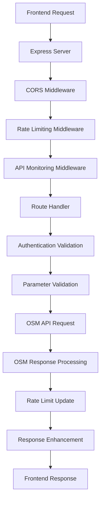
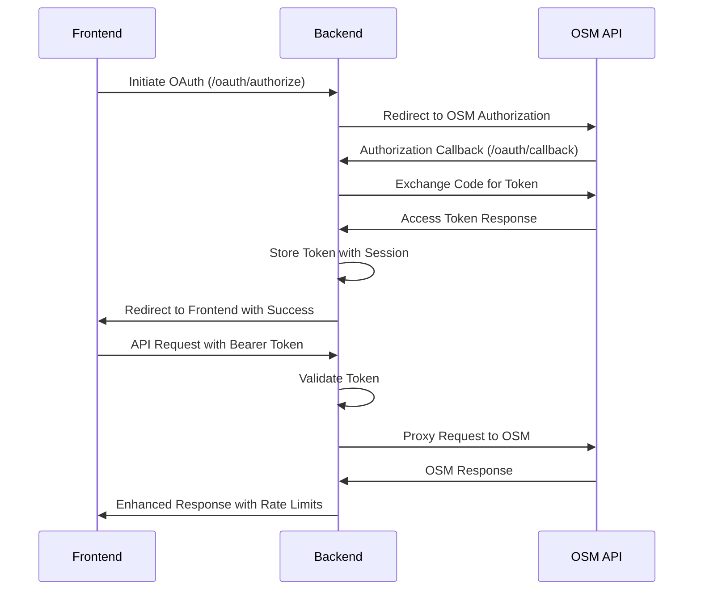
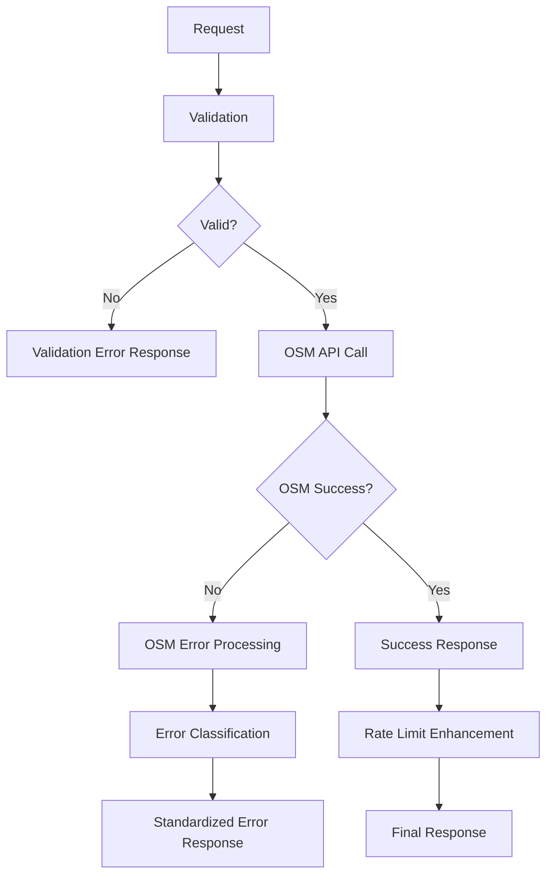

# System Architecture Overview

This document provides a high-level overview of the Vikings OSM Backend API architecture, including system components, data flow, and design patterns.

## Architecture Summary

The Vikings OSM Backend is a Node.js Express application that serves as a sophisticated proxy layer between frontend applications and the Online Scout Manager (OSM) API. It provides authentication management, rate limiting, error handling, and response standardization.

## System Components

### Core Application Layer

```
┌─────────────────────────────────────────────────────────────┐
│                    Frontend Applications                    │
│  ┌─────────────────┐  ┌─────────────────┐  ┌─────────────┐ │
│  │   Web Client    │  │  Mobile Client  │  │  PR Preview │ │
│  │   (React/Vue)   │  │    (React)      │  │   Clients   │ │
│  └─────────────────┘  └─────────────────┘  └─────────────┘ │
└─────────────────────────────────────────────────────────────┘
                                │
                                ▼
┌─────────────────────────────────────────────────────────────┐
│                Vikings OSM Backend API                      │
│                                                             │
│  ┌─────────────────┐  ┌─────────────────┐  ┌─────────────┐ │
│  │   Auth Layer    │  │  Rate Limiting  │  │   Logging   │ │
│  │   (OAuth 2.0)   │  │   (Dual-tier)   │  │  (Sentry)   │ │
│  └─────────────────┘  └─────────────────┘  └─────────────┘ │
│                                                             │
│  ┌─────────────────┐  ┌─────────────────┐  ┌─────────────┐ │
│  │   Controllers   │  │   Middleware    │  │  Utilities  │ │
│  │  (API Handlers) │  │   (CORS, etc)   │  │ (Factories) │ │
│  └─────────────────┘  └─────────────────┘  └─────────────┘ │
└─────────────────────────────────────────────────────────────┘
                                │
                                ▼
┌─────────────────────────────────────────────────────────────┐
│                Online Scout Manager API                     │
│                    (External Service)                       │
└─────────────────────────────────────────────────────────────┘
```

### Component Details

#### 1. Express Server (`server.js`)
- **Purpose**: Main application entry point and request routing
- **Responsibilities**:
  - HTTP server setup and configuration
  - Middleware registration and CORS configuration
  - Route definition and endpoint mapping
  - Error handling and graceful shutdown
  - Dynamic frontend URL detection

#### 2. Authentication Layer (`controllers/auth.js`)
- **Purpose**: OAuth 2.0 flow management and token handling
- **Responsibilities**:
  - OAuth authorization code exchange
  - Token storage and session management
  - Token validation and expiration handling
  - Logout functionality

#### 3. OSM Proxy Layer (`controllers/osm.js`)
- **Purpose**: OSM API proxy with enhanced functionality
- **Responsibilities**:
  - Request forwarding to OSM API
  - Response processing and standardization
  - Error handling and transformation
  - Rate limit integration

#### 4. Rate Limiting System (`middleware/rateLimiting.js`)
- **Purpose**: Dual-layer rate limiting protection
- **Responsibilities**:
  - Backend rate limiting (100 req/min)
  - OSM API rate limit tracking
  - Session-based limit enforcement
  - Rate limit information reporting

#### 5. Utility Layer (`utils/`)
- **Purpose**: Reusable components and helper functions
- **Components**:
  - `osmApiHandler.js`: Generic OSM API request handler
  - `validators.js`: Input validation functions
  - `responseHelpers.js`: Response standardization
  - `osmEndpointFactories.js`: Endpoint factory patterns
  - `serverHelpers.js`: Server utility functions

## Data Flow Architecture

### Request Processing Pipeline



### Authentication Flow



### Error Handling Flow



## Design Patterns

### 1. Factory Pattern

Used extensively for endpoint creation to reduce code duplication:

```javascript
// Endpoint factory creates standardized handlers
const createOSMApiHandler = (endpointName, config) => {
  return async (req, res) => {
    // Standardized processing pipeline
    // - Authentication validation
    // - Parameter validation  
    // - OSM API request
    // - Response processing
    // - Error handling
  };
};

// Simple endpoint creation
const getTerms = osmEndpoints.getTerms();
const getSectionConfig = osmEndpoints.getSectionConfig();
```

**Benefits:**
- 86% reduction in controller code (1,140 → 160 lines)
- Consistent error handling across all endpoints
- Rapid endpoint development (minutes vs hours)
- Single source of truth for common operations

### 2. Middleware Pattern

Layered middleware for cross-cutting concerns:

```javascript
// Middleware stack
app.use(cors(corsConfig));           // CORS handling
app.use(express.json());             // JSON parsing
app.use(cookieParser());             // Cookie parsing
app.use(backendRateLimit);           // Rate limiting
app.use(apiMonitoringMiddleware);    // Request monitoring
```

### 3. Proxy Pattern

The entire application implements the proxy pattern:

```javascript
// Generic proxy handler
const proxyToOSM = async (req, config) => {
  // Transform request for OSM
  const osmRequest = transformRequest(req, config);
  
  // Forward to OSM API
  const osmResponse = await fetch(osmEndpoint, osmRequest);
  
  // Transform response for frontend
  return transformResponse(osmResponse, config);
};
```

### 4. Session Management Pattern

Token and rate limit tracking per session:

```javascript
// Session-based storage
const userTokens = new Map();        // sessionId -> tokenData
const tokenToSessionId = new Map();  // token -> sessionId
const osmRateLimits = new Map();     // sessionId -> rateLimitInfo

// Session ID generation
const getSessionId = (req) => {
  const authHeader = req.headers.authorization;
  if (authHeader) {
    return crypto.createHash('sha256')
      .update(authHeader)
      .digest('hex')
      .substring(0, 16);
  }
  return req.sessionID || req.ip;
};
```

## Scalability Architecture

### Current Architecture (Single Instance)

```
Frontend → Load Balancer → Single Backend Instance → OSM API
                              ↓
                         In-Memory Storage
                         (Tokens, Rate Limits)
```

### Future Scalable Architecture

```
Frontend → Load Balancer → Multiple Backend Instances → OSM API
                              ↓
                         Shared Storage Layer
                         (Redis/Database)
```

## Security Architecture

### Authentication Security

- **OAuth 2.0 Flow**: Industry-standard authentication
- **Token Storage**: In-memory storage, no disk persistence
- **Session Isolation**: Each session has isolated token storage
- **Automatic Cleanup**: Expired tokens automatically removed

### Request Security

- **CORS Protection**: Whitelist-based origin validation
- **Rate Limiting**: Dual-layer protection against abuse
- **Input Validation**: Comprehensive parameter validation
- **Error Sanitization**: Sensitive information filtered from errors

### Frontend URL Security

```javascript
const validateFrontendUrl = (url) => {
  // Protocol validation
  if (protocol !== 'https:' && protocol !== 'http:') return false;
  
  // HTTP only for localhost
  if (protocol === 'http:' && !isLocalhost(hostname)) return false;
  
  // Domain whitelist
  return allowedDomains.includes(hostname) || 
         prPreviewPattern.test(hostname);
};
```

## Performance Architecture

### Response Time Optimization

- **Factory Pattern**: Reduces code execution overhead
- **Efficient Routing**: Direct route mapping without complex logic
- **Minimal Middleware**: Only essential middleware in the stack
- **Connection Reuse**: HTTP keep-alive for OSM API connections

### Memory Management

- **Automatic Cleanup**: Expired tokens and rate limits cleaned up
- **Efficient Storage**: Hash-based session tracking
- **Memory Monitoring**: Health endpoint reports memory usage
- **Garbage Collection**: Node.js automatic memory management

### Caching Strategy

```javascript
// Client-side caching recommendations
const cacheStrategies = {
  static: '1 hour',      // Terms, sections, user roles
  dynamic: '5 minutes',  // Events, member data
  realtime: 'no-cache'   // Attendance updates, flexi records
};
```

## Monitoring Architecture

### Structured Logging

```javascript
// Sentry integration for comprehensive monitoring
const logger = {
  info: (message, context) => sentry.captureMessage(message, 'info', context),
  error: (message, context) => sentry.captureException(message, context),
  warn: (message, context) => sentry.captureMessage(message, 'warning', context)
};
```

### Performance Monitoring

- **Request Tracking**: All requests monitored with timing
- **Error Tracking**: Comprehensive error capture and context
- **Rate Limit Monitoring**: Real-time rate limit usage tracking
- **Health Checks**: Automated health monitoring endpoints

### Alerting Strategy

```javascript
// Alert conditions
const alertConditions = {
  highMemoryUsage: 'memory > 200MB',
  highTokenCount: 'tokens > 50',
  slowRequests: 'responseTime > 5000ms',
  rateLimitApproaching: 'remaining < 10%'
};
```

## Deployment Architecture

### Auto-Deployment Pipeline

```
GitHub Repository → Railway Platform → Production Environment
       ↓                    ↓                    ↓
   Code Changes      Automatic Build      Live Application
   (main branch)     & Deployment        (Auto-scaling)
```

### Environment Management

- **Development**: Local environment with debug features
- **Testing**: Automated test environment for CI/CD
- **Production**: Railway-hosted with monitoring and scaling

## Future Architecture Considerations

### Microservices Evolution

```
Current Monolith → Future Microservices
     ↓                      ↓
Single Service    → Auth Service + Proxy Service + Monitor Service
```

### Database Integration

```
Current: In-Memory → Future: Persistent Storage
     ↓                      ↓
   Map Storage     → Redis/PostgreSQL + Session Store
```

### Advanced Features

1. **Caching Layer**: Redis for response caching
2. **Message Queue**: For async processing
3. **API Gateway**: For advanced routing and load balancing
4. **Service Mesh**: For microservices communication

## Technology Stack

### Core Technologies

- **Runtime**: Node.js 16+ (18.x LTS recommended)
- **Framework**: Express.js 4.18+
- **Authentication**: OAuth 2.0 with OSM
- **Monitoring**: Sentry for error tracking and logging
- **Testing**: Jest with Supertest for API testing

### Dependencies

```json
{
  "production": {
    "express": "Web framework",
    "cors": "Cross-origin resource sharing",
    "dotenv": "Environment variable management",
    "@sentry/node": "Error monitoring",
    "cookie-parser": "Cookie parsing middleware"
  },
  "development": {
    "jest": "Testing framework",
    "supertest": "HTTP testing",
    "eslint": "Code linting",
    "nodemon": "Development auto-restart"
  }
}
```

### Infrastructure

- **Hosting**: Railway Platform
- **Domain**: Custom domain with SSL
- **Monitoring**: Sentry + Railway metrics
- **CI/CD**: GitHub Actions + Railway auto-deploy

---

*Last updated: September 6, 2025*